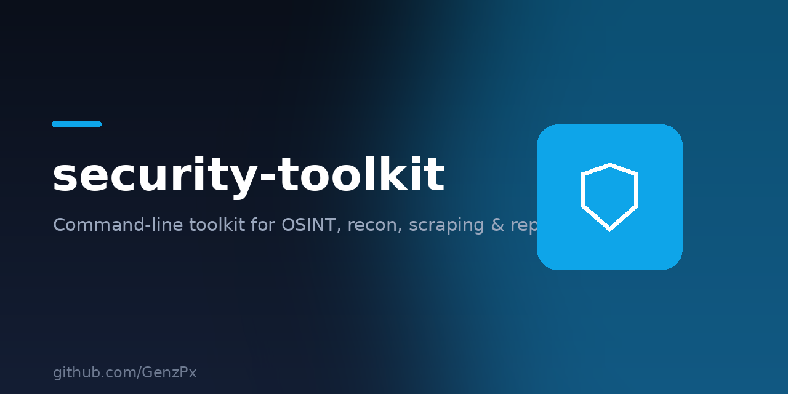

<p align="center">
  
</p>

# security-toolkit

Command-line security toolkit with modular tools for OSINT, reconnaissance, scraping, hash analysis and reporting. For educational and authorized testing only.

## Modules

- **auth** — usage disclaimer gate
- **recon** — IP / domain OSINT (ip-api.com)
- **scraper** — page title & meta extraction
- **crackers** — hash identification & wordlist cracking
- **pentest** — placeholder for authorized testing tools
- **security** — password strength & hashing utilities
- **report** — markdown report generation
- **update** — release check

## Install & Run

```bash
git clone https://github.com/GenzPx/security-toolkit.git
cd security-toolkit
python3 main.py
```

> ⚠️ Educational use only. Do not use against systems you do not own or have written permission to test.
